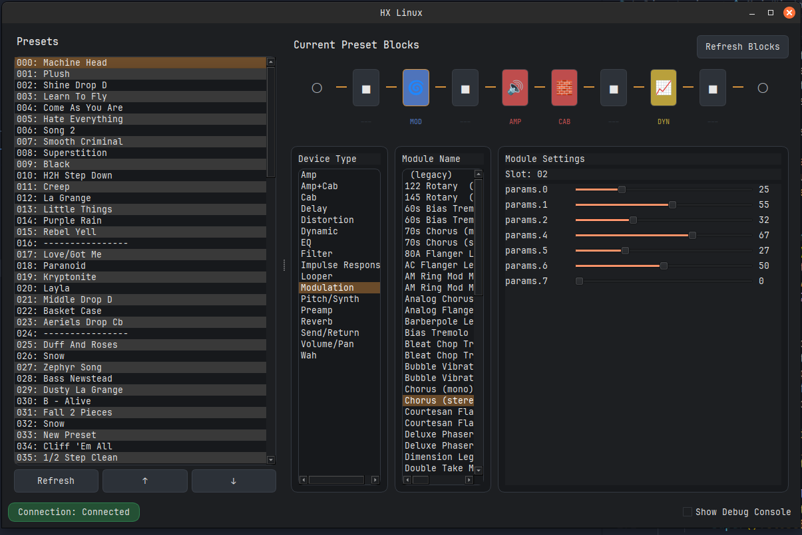

# helix_usb
helix_usb is a set of python scripts allowing for communications with Line6's HX Stomp (and maybe all other Helix products like the Helix (LT), maybe Pod Go, HX Effects and the rack version) over USB. For this, I kind of reverse engineered the protocol being send between HX Edit and the HX Stomp.   

## Getting Started
git clone https://github.com/kempline/helix_usb.git 

It is recommended to create a virtual python environment. Please install the following modules:  

* pip install pyusb
* pip install xlsxwriter
* pip install PySide6 (preferred) or PyQt6

## Minimal Desktop UI Baseline (Qt)

This repository now includes a minimal desktop UI baseline in `helix_qt_ui.py`.

Initial UI implementation screenshot:

This initial implementation provides a modern HX Edit-inspired layout for quickly demonstrating current `helix_usb.py` functionality: preset browsing/switching, preset stepping, and a live block chain view with per-block type/name/settings scaffolding.

Run it with:

* `python3 helix_qt_ui.py`

Features exposed in the baseline UI:

* List all presets (requests preset names from the connected Helix/HX device)
* Double-click preset to switch via MIDI Program Change (`p <n>` behavior, using exact list index)
* Preset step buttons (same behavior as `pu` / `pd`)
* Block view for current preset slots with simple color-coding by block category (using existing slot parsing)
* Status/log panel for connection and command feedback

Notes:

* Preset switching and stepping require MIDI interface availability (same constraints as CLI mode).
* Without connected hardware, UI can start but runtime device interactions cannot be fully verified.

Documentation: https://github.com/kempline/helix_usb/wiki

## In Action
An overview of the current features is given in 

[helix_usb - Feature Overview](https://www.youtube.com/watch?v=mRKcDVy7ZhU) 

Admitting that those features seem useless on their own, here's another video showing a typical use-case of helix_usb.

[Combining helix_usb with a Line6 FBV3](https://www.youtube.com/watch?v=1Qndof3cb20)
